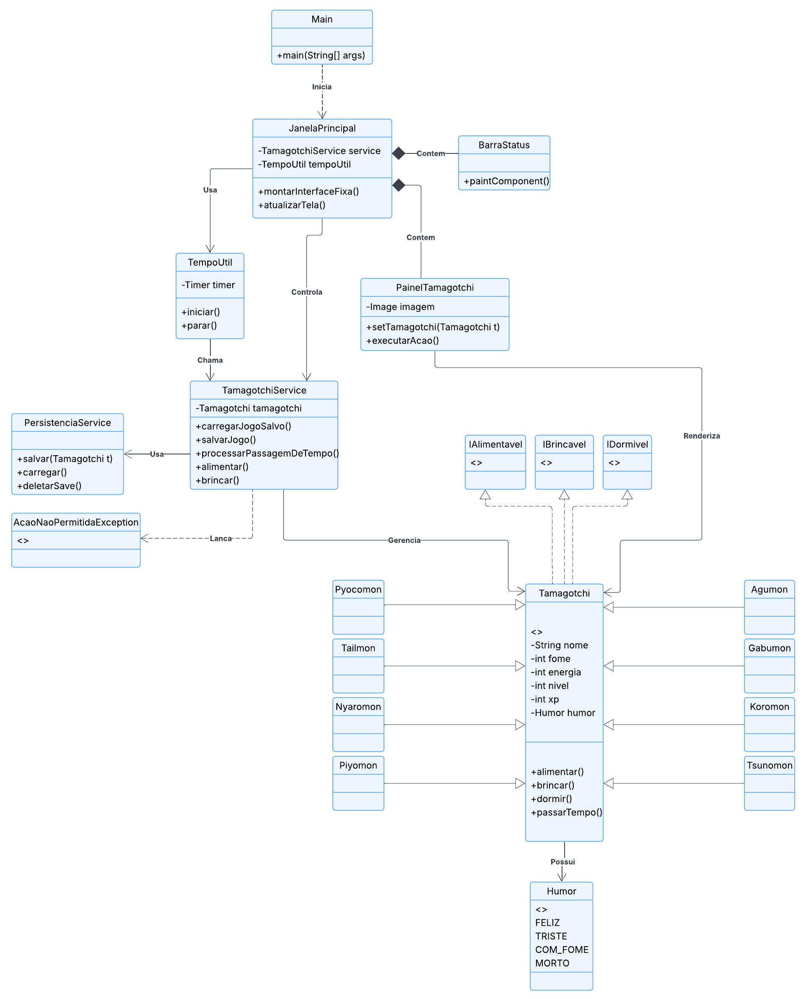

# Documentação Técnica do Projeto Tamagotchi (Digimon Edition)

## 1. Visão Geral do Sistema

O **Tamagotchi Digimon Edition** é um software de simulação de vida virtual desenvolvido em Java. O projeto utiliza uma arquitetura em camadas (Model-View-Controller adaptado) para separar a lógica de negócios da interface do usuário, garantindo alta coesão e baixo acoplamento.

O sistema foi projetado para demonstrar competência nos quatro pilares da Programação Orientada a Objetos:
1.  **Encapsulamento:** Proteção do estado interno dos objetos contra manipulação indevida.
2.  **Abstração:** Uso de classes abstratas e interfaces para definir contratos e modelos base.
3.  **Herança:** Reutilização de código e especialização de classes (Digimons específicos herdando de uma base comum).
4.  **Polimorfismo:** Capacidade de objetos (Evoluções) responderem de forma diferente sob a mesma referência, além da substituição dinâmica de instâncias em tempo de execução.

---

## 2. Detalhamento de Funcionalidades

### 2.1. Motor de Tempo (Game Loop)
O sistema não é estático. Ele implementa um modelo de **processamento concorrente** através da classe `java.util.Timer`.
* **Funcionamento:** Uma *worker thread* independente é iniciada e executa o método `passarTempo()` a cada 5000 milissegundos (5 segundos).
* **Impacto:** A cada ciclo, a Fome aumenta (+2), a Energia diminui (-1) e a Felicidade diminui (-1), obrigando o usuário a reagir.

### 2.2. Mecânica de Sobrevivência (Grace Period)
Para evitar frustração do usuário com mortes súbitas, implementou-se um algoritmo de tolerância:
* Se `Fome >= 100` ou `Energia <= 0`, o atributo interno `tempoCritico` é incrementado.
* O sistema emite alertas visuais na interface.
* Se o contador atingir 4 ciclos (aprox. 20 segundos) sem intervenção, o status `humor` é alterado para `MORTO` e o jogo é encerrado.

### 2.3. Sistema de Evolução Dinâmica
O projeto utiliza polimorfismo para evoluir as criaturas.
* Ao atingir **Nível 2**, o `TamagotchiService` detecta a condição.
* O objeto atual (ex: `Koromon`) é descartado e substituído por uma nova instância de classe superior (ex: `Agumon`).
* Os dados persistentes (xp, dias vividos) são migrados para o novo objeto, mantendo a continuidade da experiência.

### 2.4. Persistência de Dados (Serialização)
O estado do jogo é salvo fisicamente no disco.
* **Tecnologia:** Serialização Binária Java (`java.io.Serializable`).
* **Arquivo:** `savegame.dat`.
* **Segurança:** O sistema possui uma validação ao carregar (`load`). Se o arquivo contiver um Digimon morto, o arquivo é deletado automaticamente para forçar um reinício limpo (`Hardcore Permadeath`).

---

## 3. Descrição das Entidades e Atributos

### 3.1. Classe Base: `Tamagotchi`
A classe pai de todo o sistema. É **abstrata**, impedindo a criação de instâncias genéricas.

| Modificador | Tipo | Nome Atributo | Descrição Técnica |
| :--- | :--- | :--- | :--- |
| `private` | `String` | `nome` | Identificador da espécie do Digimon. |
| `private` | `int` | `fome` | Valor de 0 a 100. Validação no setter impede valores negativos ou >100. |
| `private` | `int` | `energia` | Valor de 0 a 100. Controla o cansaço. |
| `private` | `int` | `felicidade` | Valor de 0 a 100. Afeta o status de humor. |
| `private` | `int` | `nivel` | Inteiro incremental. Gatilho para evolução. |
| `private` | `int` | `experiencia` | Acumulador. Zera ao atingir `getXpNecessario()`. |
| `private` | `int` | `diasVividos` | Contador de persistência temporal. |
| `private` | `Humor` | `humor` | Enumeração do estado atual. |
| `private` | `int` | `tempoCritico` | Contador oculto para lógica de *Game Over*. |

### 3.2. Balanceamento das Espécies (Subclasses)
Embora herdem os atributos, cada classe concreta inicializa o construtor com valores diferentes para criar variedade na jogabilidade.

| Classe (Espécie) | Estágio | Energia Inicial | Fome Inicial | Felicidade Inicial | Característica |
| :--- | :--- | :--- | :--- | :--- | :--- |
| **Koromon** | Bebê | 80 (Frágil) | 20 | 75 | Fácil de cuidar. |
| **Tsunomon** | Bebê | 80 (Frágil) | 25 | 75 | Equilibrado. |
| **Pyocomon** | Bebê | 80 (Frágil) | 25 | 80 | Fica feliz fácil. |
| **Nyaromon** | Bebê | 80 (Frágil) | 25 | 75 | Equilibrado. |
| **Agumon** | Criança | 100 (Forte) | 30 | 80 | Alta resistência. |
| **Gabumon** | Criança | 95 (Médio) | 30 | 70 | Exige mais atenção. |
| **Piyomon** | Criança | 90 (Médio) | 30 | 80 | Evolução balanceada. |
| **Tailmon** | Criança | 90 (Médio) | 30 | 85 | Alta felicidade base. |

---

## 4. Estrutura de Pacotes

Abaixo, a representação visual da organização física dos arquivos do projeto:

```text
ProjetoTamagotchi/
│
├── doc/
│   └── DOCUMENTACAO.md       <-- Este arquivo
│
├── src/
│   └── br/
│       └── com/
│           └── tamagotchi/
│               ├── entidades/
│               │   ├── Tamagotchi.java
│               │   ├── Agumon.java
│               │   └── ... (Demais subclasses)
│               │
│               ├── enums/
│               │   └── Humor.java
│               │
│               ├── exceptions/
│               │   └── AcaoNaoPermitidaException.java
│               │
│               ├── gui/
│               │   ├── JanelaPrincipal.java
│               │   ├── PainelTamagotchi.java
│               │   └── BarraStatus.java
│               │
│               ├── interfaces/
│               │   ├── IAlimentavel.java
│               │   ├── IBrincavel.java
│               │   └── IDormivel.java
│               │
│               ├── main/
│               │   └── Main.java
│               │
│               ├── recursos/
│               │   ├── imagens/   <-- Assets visuais (.png, .gif)
│               │   └── sons/      <-- Assets sonoros (.wav)
│               │
│               ├── servicos/
│               │   ├── TamagotchiService.java
│               │   └── PersistenciaService.java
│               │
│               └── util/
│                   └── TempoUtil.java
│
└── README.md                 <-- Instruções de execução
```

### Pacote `br.com.tamagotchi.entidades`
Contém o modelo de domínio.
* **`Tamagotchi.java`**: Define a lógica central. Contém os métodos `alimentar()`, `brincar()`, `dormir()` e `passarTempo()`.
* **Classes Filhas (`Agumon.java`, etc.)**: Estendem `Tamagotchi`. Possuem apenas o construtor `super()` para definição de status, delegando todo o comportamento para a superclasse (Herança Pura).

### Pacote `br.com.tamagotchi.servicos`
Contém a lógica de aplicação e orquestração.
* **`TamagotchiService.java`**:
    * `carregarJogoSalvo()`: Tenta restaurar o save.
    * `processarPassagemDeTempo()`: Método chamado pelo Timer. Chama o envelhecimento da entidade e verifica se ocorreu morte.
    * `checarEvolucao()`: Verifica o nível e realiza a troca de instâncias (ex: Koromon -> Agumon).
* **`PersistenciaService.java`**:
    * Encapsula as classes `ObjectOutputStream` e `FileInputStream`.
    * Isola a complexidade de IO (Input/Output) do restante do sistema.

### Pacote `br.com.tamagotchi.util`
* **`TempoUtil.java`**:
    * Gerencia o ciclo de vida da Thread de tempo.
    * Possui métodos `iniciar()` e `parar()` para controle seguro do Timer, evitando *memory leaks* (vazamento de memória) ao fechar o jogo.

### Pacote `br.com.tamagotchi.interfaces`
Define os contratos de capacidade dos seres.
* **`IAlimentavel`**: Garante método `alimentar()`.
* **`IBrincavel`**: Garante método `brincar()`.
* **`IDormivel`**: Garante método `dormir()`.

### Pacote `br.com.tamagotchi.enums`
* **`Humor.java`**: Enumeração contendo: `FELIZ`, `TRISTE`, `COM_FOME`, `CANSADO`, `MORTO`. Usado para controle de fluxo e lógica de exibição de imagens.

### Pacote `br.com.tamagotchi.exceptions`
* **`AcaoNaoPermitidaException.java`**:
    * Tipo: *Checked Exception*.
    * Uso: Lançada quando uma regra de negócio é violada (Ex: Tentar alimentar um Digimon com `Fome == 0`).
    * Objetivo: Obrigar a camada de interface a tratar o erro e exibir um feedback visual ao usuário.

### Pacote `br.com.tamagotchi.gui` (Interface Gráfica)
* **`JanelaPrincipal.java`**: Classe que herda de `JFrame`. Configura o layout, botões e labels. Gerencia os eventos de clique do mouse e atualiza a tela via `Timer` de renderização (60 FPS simulado).
* **`PainelTamagotchi.java`**: Classe avançada de renderização gráfica.
    * Gerencia troca de sprites.
    * Implementa algoritmo de interpolação visual (Morphing) para suavizar a transição na evolução.
    * Renderiza GIFs animados usando `Graphics2D`.
* **`BarraStatus.java`**: Componente visual customizado que desenha retângulos coloridos proporcionais aos valores inteiros dos atributos do Digimon.

---

## 5. Arquitetura do Sistema (Diagrama de Classes)

Abaixo, a representação visual completa da arquitetura do sistema em UML (Unified Modeling Language). O diagrama detalha as relações de **Herança** entre os Digimons, as **Dependências** entre a interface gráfica e os serviços, e a **Composição** dos elementos da tela.


*Figura 1: Diagrama de Classes detalhando a estrutura, herança e dependências do projeto.*

---

## 6. Bibliotecas Utilizadas

O projeto foi desenvolvido utilizando exclusivamente as bibliotecas padrão do **Java Development Kit (JDK)**, garantindo portabilidade sem a necessidade de dependências externas (`.jar`).

| Pacote | Funcionalidade no Projeto |
| :--- | :--- |
| **`java.io`** | Responsável pela Entrada e Saída de dados (Classe `File`) e pela Serialização de objetos para salvar o jogo (`ObjectOutputStream`, `Serializable`). |
| **`java.util`** | Fornece utilitários essenciais como `Timer` (para o loop do jogo), `Random` (para sortear o ovo) e `Scanner` (para entrada de dados). |
| **`javax.swing`** | Biblioteca principal da Interface Gráfica, fornecendo os componentes visuais (`JFrame`, `JPanel`, `JLabel`, `Timer` de renderização). |
| **`java.awt`** | Utilizado para manipulação gráfica avançada (`Graphics2D`, `Image`, `Color`) e gerenciamento de layout. |
| **`java.awt.event`** | Responsável pela captura de interações do usuário, como cliques do mouse (`MouseAdapter`, `MouseEvent`). |
| **`javax.sound.sampled`** | Biblioteca de áudio utilizada para carregar e reproduzir os efeitos sonoros `.wav` (evolução). |